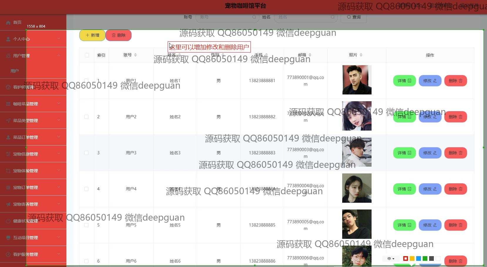
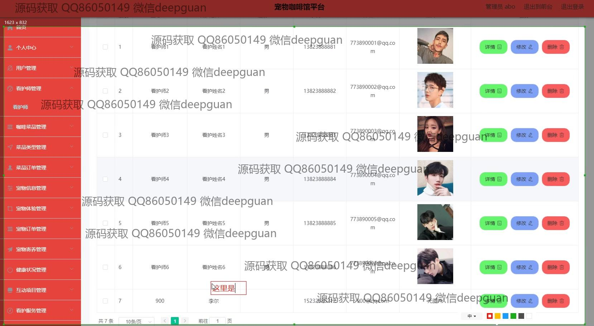
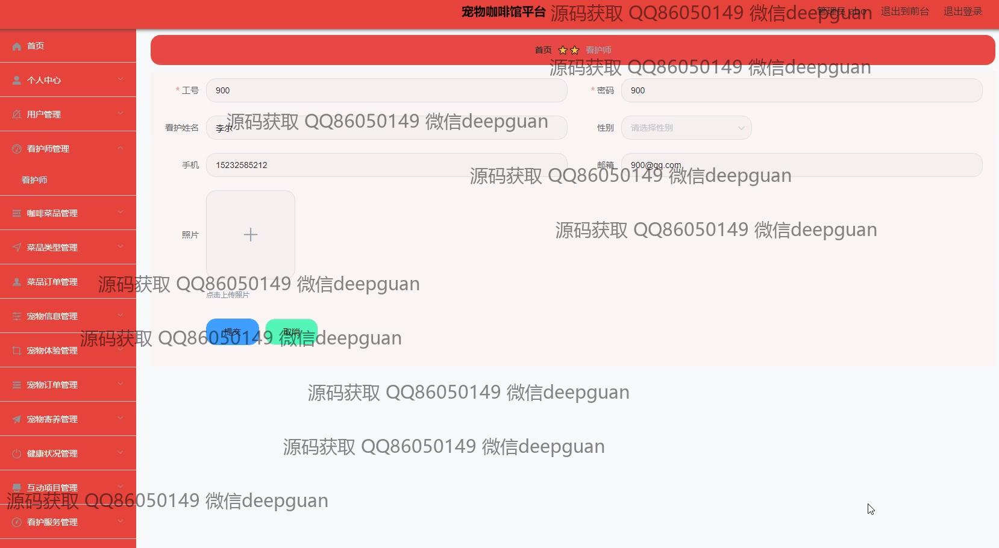
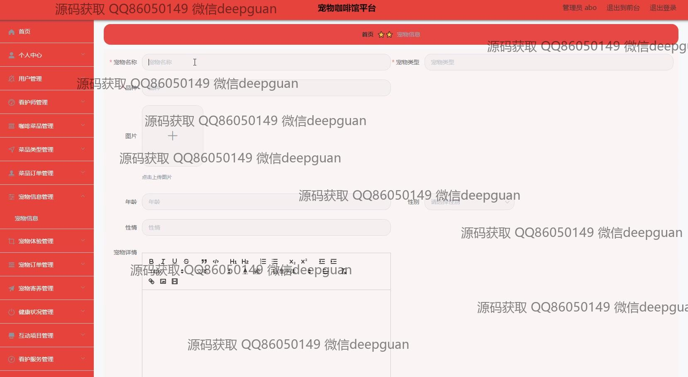
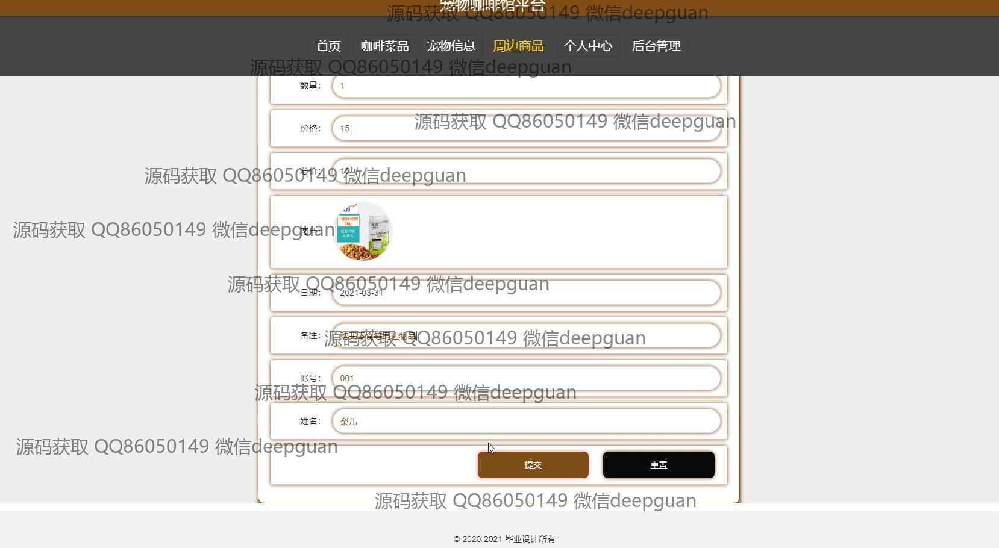

<h1 align="center">宠物咖啡馆平台的设计与实现</h1>

## 简介
宠物咖啡馆平台：角色分为管理员、用户和兽医；功能包括用户注册登录、宠物信息管理、咖啡菜单管理、订单管理、宠物体验和寄养管理、健康状况和看护服务管理。    --计算机毕业设计源码；毕设源码；java毕业设计源码

## 联系方式

<h3 align="center">获取完整代码与数据库文件 + 微信：deepguan QQ: 86050149 QQ群: 783742310</h3>

<h3 align="center">可帮忙远程部署 包运行成功！提供远程部署、修改代码、设计文档指导、代码讲解等服务！</h3>

## 功能介绍（完整见运行截图）
管理员：基本功能包括登录、注册、退出，以及用户信息管理和权限分配。在宠物咖啡馆平台上，管理员可以通过主导航栏访问系统的多个模块，进行用户、宠物信息、订单、健康状况和菜品等全面管理。平台具备用户审核、订单审核和系统设置功能，支持订单详细信息查看、修改和删除操作，帮助管理员高效维护和运营平台。

用户：用户可以通过注册和登录进入宠物咖啡馆平台，浏览和选择宠物信息、咖啡馆菜单和周边商品。用户界面提供查看宠物详细信息、品种、年龄、图片上传和社区互动功能，如评论和点赞。用户能够在线预订宠物体验、寄养服务，并通过平台进行订单管理，包括支付和审核订单状态，提供便捷的服务使用体验。

看护师：看护师通过审核后可以访问平台，管理分配到的宠物信息，记录宠物的健康状况和服务时间，如疫苗注射、喂食和毛发修剪等。看护师可以上传宠物的照片和视频，填写详细的照护记录，确保宠物得到优质的生活和康护服务。此外，支持与用户实时沟通，优化宠物护理体验。

宠物主人：宠物主人通过平台注册并认证后可以查看宠物的健康、寄养和护理状况。可以预约宠物体验活动，上传宠物资料照片，并在需要时与看护师进行互动。平台的评论和反馈功能也为主人提供了分享体验和建议的渠道，促使更好的宠物护理服务。

## 运行截图

本代码来源于网络,仅供学习参考使用!

